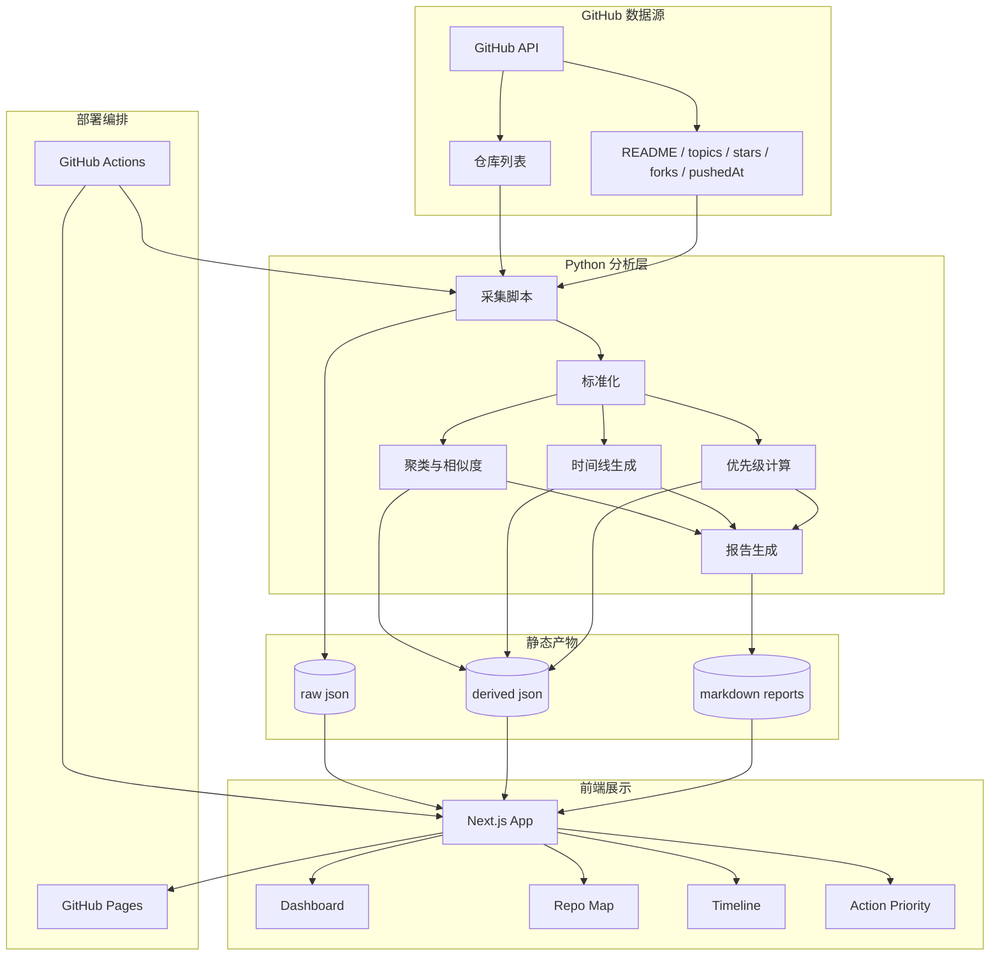

# Repo Atlas Architecture v1

## 1. 项目定位

Repo Atlas 是一个面向 GitHub 账号的全局分析工作台，用于把一个账号下的仓库集合变成可观察、可聚类、可演化追踪、可行动的结构化系统。

它主要解决四类问题：

- 我有哪些仓库，它们整体是什么构成？
- 这些仓库之间有什么关系，能否聚类？
- 过去一段时间我的仓库生态如何演化？
- 当前最值得优先处理的事项是什么？

Repo Atlas 也可以用于研究 GitHub 上热门作者的账号结构，观察他们在做什么，并辅助学习与模仿。

---

## 2. 形态与边界

### 2.1 形态

Repo Atlas 采用 **静态分析工作台** 的形态：

- Python 负责抓取和分析数据
- GitHub Actions 负责编排定时任务和生成产物
- Next.js + React + TypeScript 负责前端展示
- GitHub Pages 负责静态部署

### 2.2 边界

Repo Atlas **不是**：

- 仓库批量维护工具
- 常驻后端服务平台
- 多用户协作系统
- 重数据库驱动的业务系统

Repo Atlas **是**：

- GitHub 账号级认知系统
- 结构化分析与研究工具
- 面向全局视角的静态工作台

CloneX 继续承担执行层职责，Repo Atlas 负责认知层职责。

---

## 3. 技术栈

### 3.1 数据与分析端

- Python 3.10+
- `requests` 或 GitHub API SDK
- `pydantic`
- `networkx`
- 标准库 `json` / `pathlib` / `dataclasses`

### 3.2 前端

- Next.js
- React
- TypeScript
- Tailwind CSS
- shadcn/ui（可选）
- ECharts 或 D3.js

### 3.3 部署

- GitHub Actions
- GitHub Pages

### 3.4 数据存储

第一版不引入数据库，采用静态文件：

- `data/raw/*.json`
- `data/derived/*.json`
- `data/reports/*.md`
- `public/assets/*`

如果未来数据规模增大，再考虑 SQLite 作为可选升级。

---

## 4. 高层架构



---

## 5. 数据流

### 5.1 采集

由脚本从 GitHub API 拉取：

- 仓库列表
- 仓库元数据
- topics
- README
- fork 来源
- stars / forks / archived / language / pushedAt

### 5.2 处理

采集结果进入标准化流程：

- 字段统一
- 生成仓库画像
- 计算活跃度
- 计算相似度
- 识别主题簇
- 生成生命周期标签

### 5.3 输出

处理后的结果输出为静态文件：

- 全局总览数据
- 仓库聚类数据
- 时间线数据
- 优先级建议数据
- 文本报告

### 5.4 展示

前端直接读取静态数据并渲染页面。

---

## 6. 领域模型

### 6.1 `AccountProfile`

账号画像，包含：

- login
- name
- bio
- blog
- followers
- following
- created_at

### 6.2 `RepositoryProfile`

仓库画像，包含：

- name
- full_name
- description
- language
- created_at
- pushed_at
- archived
- fork
- private
- stars
- forks
- topics
- size
- parent_repo

### 6.3 `RepoCluster`

仓库聚类对象，包含：

- cluster_id
- label
- repos
- confidence
- rationale

### 6.4 `TimelineEvent`

演化事件对象，包含：

- repo
- timestamp
- event_type
- significance

### 6.5 `PortfolioInsight`

组合洞察对象，包含：

- observation
- evidence
- priority
- recommended_action
- confidence

### 6.6 `ActionItem`

行动建议对象，包含：

- title
- why_now
- target_repo
- priority
- expected_outcome

---

## 7. 页面结构

### 7.1 全局仪表盘

展示：

- 仓库总数
- source / fork 比例
- public / private 比例
- 最近活跃仓库
- 沉默仓库
- 关键仓库排行
- 主题分布

### 7.2 仓库地图

展示：

- 聚类图
- 关系拓扑
- 派生链路
- 输入 / 处理 / 输出路径

### 7.3 演化时间线

展示：

- 按月 / 季度变化
- 项目阶段迁移
- 主题上升 / 下降趋势

### 7.4 组合分析

展示：

- 合并候选
- 拆分候选
- 归档候选
- 投入优先级

### 7.5 研究问答

展示：

- 自然语言提问
- 证据回溯
- 相关仓库引用
- 可解释结论

---

## 8. MVP 范围

### 第一版必须完成

1. 拉取 GitHub 仓库元数据
2. 生成全局仪表盘数据
3. 生成仓库聚类与关系图数据
4. 生成优先级建议数据
5. 静态页面可视化展示

### 第一版不做

- 在线登录系统
- 多用户协作
- 常驻 API 服务
- 重量级数据库
- 复杂训练流程
- 实时流式计算

---

## 9. 推荐目录结构

```text
repo-atlas/
├─ README.md
├─ docs/
│  └─ architecture.md
├─ data/
│  ├─ raw/
│  ├─ derived/
│  └─ reports/
├─ scripts/
│  ├─ fetch_repos.py
│  ├─ analyze_portfolio.py
│  └─ render_reports.py
├─ web/
│  ├─ app/
│  ├─ components/
│  ├─ lib/
│  └─ public/
├─ .github/
│  └─ workflows/
│     └─ build-and-deploy.yml
└─ pyproject.toml
```

---

## 10. GitHub Actions 部署流程

1. 定时触发或手动触发
2. Python 脚本采集 GitHub 数据
3. Python 脚本生成分析结果和静态报告
4. 构建 Next.js 静态站点
5. 发布到 GitHub Pages

---

## 11. 设计原则

1. **先结构化，再智能化**
2. **先可解释，再自动化**
3. **先单账号，再多账号**
4. **先静态展示，再复杂交互**
5. **先认知，再行动**

---

## 12. 结论

Repo Atlas 的本质是一个 GitHub 账号级的静态认知工作台。

它的价值不在于做仓库管理，而在于：

- 看清整体构成
- 识别关系与聚类
- 理解演化方向
- 找出高优先级行动
- 为研究与学习提供全局视角
